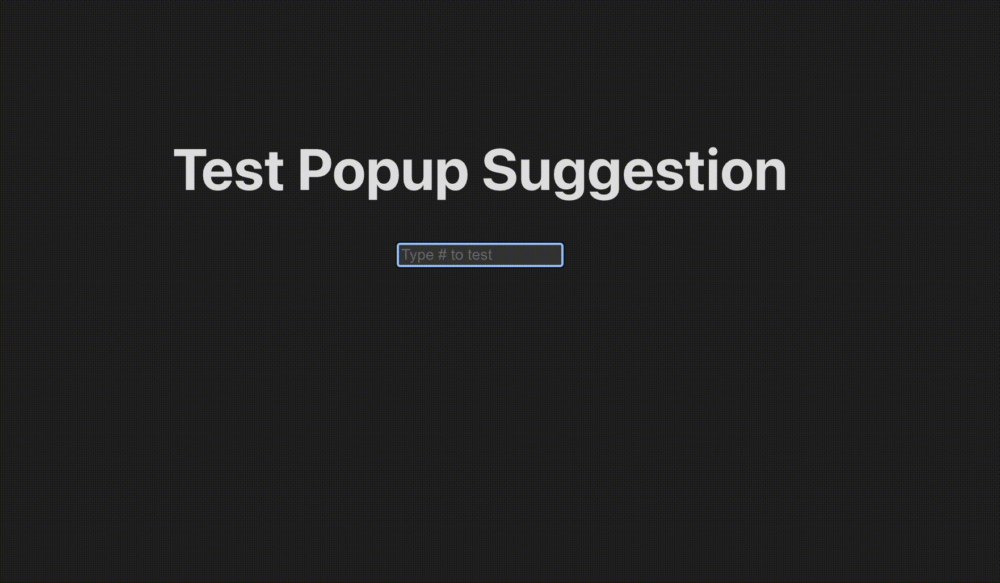

# PopupSuggestion

PopupSuggestion is a lightweight Vanilla JavaScript library that provides an auto-suggestion popup when a specific trigger key (default: `#`) is pressed inside an input field or textarea. The suggestions are fetched from a JSON file and displayed in a styled popup.



## Features

- Supports any input field or textarea.
- Customizable styles including colors, fonts, borders, and sizes.
- Allows navigation using keyboard (`ArrowUp`, `ArrowDown`, `Enter`, `Escape`).
- Dynamically filters suggestions based on user input.
- Supports optional borders between items with customizable color.

## Installation

You can install the package via npm:

```sh
npm install popup-suggestion
```

## Usage

### Import the Module (if using ES6 modules)

```javascript
import PopupSuggestion from "popup-suggestion";
```

### Initialize the PopupSuggestion

```javascript
const popup = new PopupSuggestion("path/to/data.json", {
  triggerKey: "#",
  fontSize: "14px",
  color: "white",
  backgroundColor: "#0e1116",
  borderRadius: "7px",
  hoverColor: "#386ee3",
  showBorders: true,
  borderColor: "#ccc",
  width: "300px",
  height: "200px",
  textOverflow: "wrap",
});
```

### JSON Data Format

The JSON file should contain an array of objects with `id` and `title` fields:

```json
[
  { "id": "123", "title": "First suggestion" },
  { "id": "124", "title": "Second suggestion" }
]
```

## Options

The constructor accepts an optional `options` object to customize the appearance and behavior.

### Required Parameter

| Name      | Type   | Description                                          |
| --------- | ------ | ---------------------------------------------------- |
| `jsonUrl` | String | Path or URL to the JSON file containing suggestions. |

### Optional Parameters

| Name              | Type    | Default                   | Description                                      |
| ----------------- | ------- | ------------------------- | ------------------------------------------------ |
| `triggerKey`      | String  | `#`                       | Key that triggers the popup.                     |
| `fontSize`        | String  | `12px`                    | Font size of suggestions.                        |
| `color`           | String  | `white`                   | Text color.                                      |
| `backgroundColor` | String  | `#0e1116`                 | Background color of the popup.                   |
| `borderRadius`    | String  | `7px`                     | Border radius of the popup.                      |
| `hoverColor`      | String  | `#386ee3`                 | Background color of hovered item.                |
| `showBorders`     | Boolean | `true`                    | Whether to show a border between items.          |
| `borderColor`     | String  | Light shade of text color | Color of item borders.                           |
| `width`           | String  | `300px`                   | Maximum width of the popup.                      |
| `height`          | String  | `200px`                   | Maximum height of the popup.                     |
| `textOverflow`    | String  | `wrap`                    | How text should overflow (`wrap` or `ellipsis`). |

## Keyboard Shortcuts

| Key                 | Action                          |
| ------------------- | ------------------------------- |
| `#` (or custom key) | Opens the popup.                |
| `ArrowUp`           | Navigate up.                    |
| `ArrowDown`         | Navigate down.                  |
| `Enter`             | Select highlighted item.        |
| `Escape`            | Close the popup.                |
| `Backspace`         | Update filtering as user types. |

## License

This package is licensed under the MIT License.
